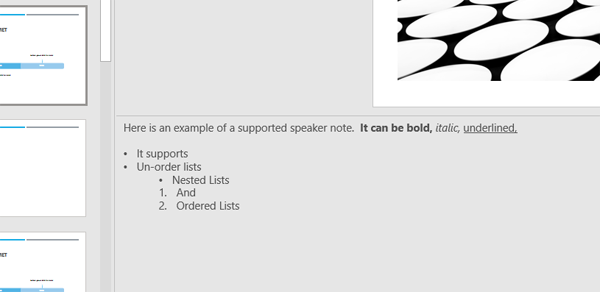

# PowerPoint HTML Generator


**Library for Parsing *.pptx* Speaker Notes**
Speaker Notes can be parsed converted to HTML 

This libary uses OpenXML to parse Powerpoint Documents and generates the equivilant html markup as an output.

#### Sample Powerpoint Speaker Notes


#### Generates This HTML
```
<p>
  Here is an example of a supported speaker note.  
  <strong>It can be bold,  </strong><i>italic,</i><u>underlined, </u>
</p>
<ul>
  <li>It supports </li>
  <li>Un-order lists</li>
  <ul>
    <li>Nested Lists</li>
  </ul>
  <ol>
    <li>And</li>
    <li>Ordered Lists</li>
  </ol>
</ul>
```

## Available On Nuget
```
PM > Install-Package AaksPowerPointParser
```
This and previous releaes are available on our [Nuget Page](https://www.nuget.org/packages/AaksPowerPointParser)

## Server-Side Friendly
This library makes **no use** of the _Microsoft Innteropt_ libraries, does not rely on an instance of Microsoft Powerpoint and therefor **is suitable for use on servers**.

If you are unfamiliar on server-side concerns and Office automation, Microsoft has provided more detailed information on why their interpot libraries are not suitable for [Microsoft Office Server-Side Office Automation](https://support.microsoft.com/en-us/topic/considerations-for-server-side-automation-of-office-48bcfe93-8a89-47f1-0bce-017433ad79e2).

## Demo Client

**HtmlGenerationClinet**
Included in this project is a simple console application design to demo this functinality.  You will be promoted for the absolute path of any .pptx file on your local system and a randomly named .html file equivilant will be generated on your desktop.  

Enter the absolute path of your _.pptx_ file in the console window


And a timestamped _.html_ file with some basic styling will be created saved to your desktop 


## License

Apache License 2.0 
